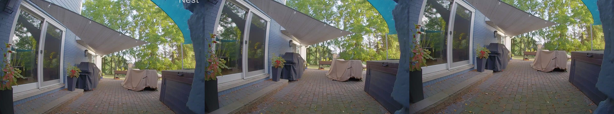
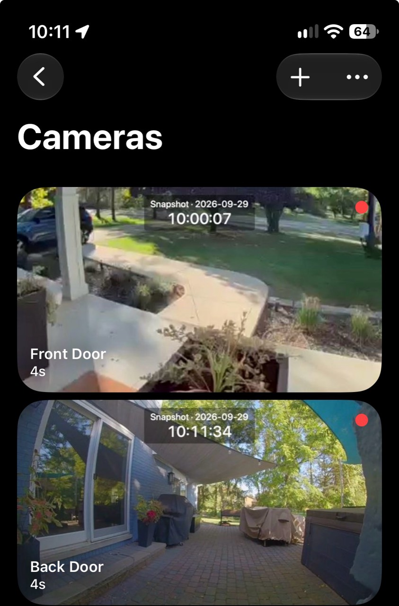
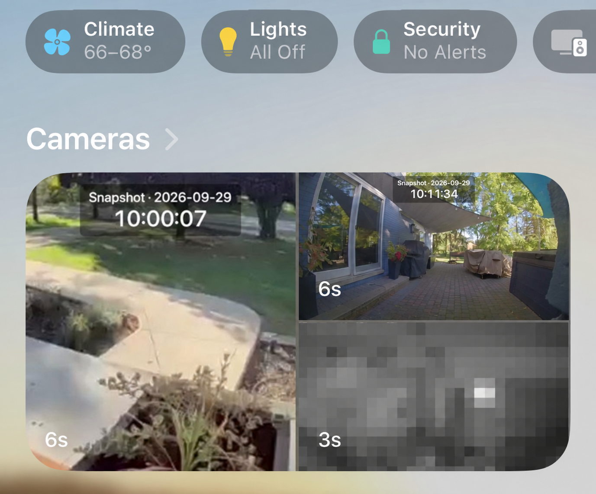

# Nest snapshot cache prototype

> **Platform note:** This is a macOS-first companion service for Scrypted and
> Apple Home. The current deployment is tested on an Apple silicon Mac running
> Scrypted. The Python/FFmpeg snapshot pipeline may be adaptable to other
> platforms, but those platforms are not yet packaged or tested.

Author: Philippe Sainte-Marie (`p808u2`)  
Project type: personal research and working prototype  
Development assistance: OpenAI Codex

This localhost-only service gives Scrypted a stable JPEG URL while keeping the
Nest cloud stream idle most of the time. A request returns the last cached JPEG
immediately and starts a rate-limited refresh in the background when the image
is stale. If no cache exists yet, the first request waits briefly for capture.

Snapshot endpoints:

- Front Door: `http://127.0.0.1:18765/front.jpg`
- Back Door: `http://127.0.0.1:18765/back.jpg`

These friendly snapshot paths are provided by this service. They are separate
from the opaque RTSP path that Scrypted generates for each rebroadcast stream.
Copy the Scrypted RTSP URL exactly as shown; do not replace its path with the
camera's friendly name.

Health endpoint: `http://127.0.0.1:18765/health`

Configuration examples and instructions are in [`CONFIGURATION.md`](CONFIGURATION.md).
The repository includes both a generic template and a fully filled fictional
example; neither contains a real camera URL.

For a clean macOS installation, see [`INSTALL-MACOS.md`](INSTALL-MACOS.md).
The repository includes a generic launchd template; the original machine-
specific migration files are intentionally not published.

Endpoint verification: `/opt/homebrew/bin/python3 verify.py`. This requests
snapshots and can trigger the normal background refresh when a cache is stale.

## Deployment and automatic startup

Both Scrypted and this snapshot HTTP service are installed as system
LaunchDaemons with RunAtLoad and KeepAlive. They start independently of a
desktop login after macOS boots and are relaunched if they exit. See
`BOOT-RECOVERY.md` for verified deployment details and the remaining FileVault
cold-boot unlock requirement. No browser window needs to remain open.

The timestamp renderer is deployed at `timestamp-overlay` and invoked for each
capture. Rebuild after edits with:

```sh
clang -fobjc-arc -framework AppKit timestamp-overlay.m -o timestamp-overlay
```

Renderer changes apply on the next refresh without restarting the service.
For changes to server.py or config.json, restart the system service with
`sudo launchctl kickstart -k system/com.pixelo.nest-snapshot-cache`.

Each source is a Scrypted on-demand RTSP rebroadcast. Connecting to one starts
that camera's underlying Nest stream; ffmpeg captures one frame and disconnects.
Continuous prebuffering is not used.

Captured frames are normalized to a true 1280x720 JPEG without stretching.
Front Door is biased 65% toward the bottom of its portrait source, retaining
more driveway and the upper part of the rug. Back Door uses a centered crop from
its 4:3 landscape source. Each JPEG receives a top-centered two-line capture label
in local 24-hour time with leading zeros, for example
`Snapshot · 2026-09-07 08:45:10`. This is the Mac's frame receipt time, an
approximation of capture time rather than a camera-provided exposure timestamp.
The time uses 54-point type, with a smaller 32-point
date/Snapshot heading above it, on a translucent background. Centering keeps
the label visible when Home crops the sides of its mosaic tiles.

Each new image is decoded and checked before and after timestamp rendering.
A conservative repeated-row detector rejects the vertical smearing seen in
corrupt snapshots. Rejection preserves the previous cache; subsequent requests
or events can retry under the existing refresh rules. Health reports rejection
counts and the last rejection reason. This heuristic cannot detect every image
defect and may occasionally reject legitimate repetitive scenes.

## Refresh behavior

- A cached JPEG is returned immediately.
- When Scrypted or HomeKit requests a snapshot older than 30 seconds, the
  cached image is returned first and a new frame is captured in the background.
- If Home stops requesting thumbnails, this age-based refresh also stops.
- The health endpoint reports each camera's request count, most recent request
  age, and most recent request interval. These counters reset with the service.
- Scrypted automation **Front Door Snapshot Refresh** also listens for Front
  Door motion and doorbell-ring events. It waits 30 seconds, then requests a
  refresh.
- Back Door uses the equivalent **Back Door Snapshot Refresh** automation.
- The background scheduler captures both cameras at the top of every hour and
  15 minutes after calculated Detroit sunrise and sunset. It uses the same
  serialized capture and quality checks as on-demand refreshes.
- Refresh attempts are serialized; the camera stream is closed after one frame.

## Rollback

1. Clear **Snapshot → Snapshot URL** on both doorbells, return **Snapshots from
   Prebuffer** to **Default**, and save.
2. Turn off or remove the Scrypted automations **Front Door Snapshot Refresh**
   and **Back Door Snapshot Refresh**.
3. Stop the snapshot service with
   `sudo launchctl bootout system/com.pixelo.nest-snapshot-cache`.
4. Remove `/Library/LaunchDaemons/com.pixelo.nest-snapshot-cache.plist` to prevent
   its next boot launch. Keep the project and cached images until rollback is verified.
5. See `BOOT-RECOVERY.md` if restoring login-based startup instead of removing
   the snapshot service. Scrypted's separate boot service need not be removed.

See `DEVELOPER-NOTES.md` for the reusable design idea and possible Scrypted
plugin improvements suggested by this prototype.

## Choosing a crop visually

The service always emits a 16:9 image. When the source is taller or wider than
16:9, it crops rather than stretches the image. The `crop_vertical_bias` value
controls the vertical position of the crop:

- `0.00` keeps the crop toward the top.
- `0.50` centers the crop.
- `1.00` keeps the crop toward the bottom.

The best value depends on the camera's native framing. These examples are
included so the images can be reused as a quick visual tuning guide.

### Portrait or tall source

For a tall doorbell feed, start with a lower crop when the important view is the
walkway, porch, or driveway. Compare these examples before choosing a value:

| Example | Starting value | What it preserves |
| --- | ---: | --- |
| [Upper crop](lower-crop-preview.jpg) | `0.50` | More of the upper scene and roofline |
| [Balanced lower crop](lower-crop-65-preview.jpg) | `0.65` | A useful mix of doorway, walkway, and foreground |
| [Strong lower crop](lower-crop-85-preview.jpg) | `0.85` | More foreground, driveway, or rug; less sky/tree canopy |

For the portrait-style front doorbell in this prototype, `0.65` was the best
starting point. It kept the approach and driveway visible without losing the
door area.

### Landscape source

For a native landscape feed, the main decision is usually whether to preserve
the full width or accept a little side cropping to keep the HomeKit image at
16:9. The comparison below shows three 16:9 layouts from the same source:



The centered crop (`0.50`) was the best choice for the back door in this setup.
It retained the door, patio, rug, and enough driveway without stretching the
image. The [layout comparison](layout-comparison.jpg) shows the same idea with
different framing choices side by side.

As a practical rule, begin with `0.50`, then try `0.65` if the important action
is lower in the frame. Use `0.85` only when the foreground is much more useful
than the upper part of the scene. Always judge the result in the HomeKit tile,
because Home may crop the image again when it displays a camera mosaic.

## How the result appears in Apple Home

The most useful test is the final Home app view, not just the JPEG by itself.
These examples show the same two cameras after they have been normalized to
16:9 and given the timestamp overlay.

### Individual camera view



The tall front-door source and the wider back-door source now occupy the same
visual shape without stretching. The timestamp makes it clear which image is
the hourly fallback and which one was refreshed moments ago.

### Home camera mosaic



This is the layout that matters most in day-to-day use. Apple Home may crop the
images again inside the mosaic, so the crop should be judged here as well as in
the standalone JPEG. The front door remains readable even though its native
feed is taller, while the back door keeps the patio and driveway in view.

The mosaic example intentionally blurs the unrelated MyQ/garage tile. The
repository also includes failure examples from the original setup for
comparison: `Snapshot Failed`, stale tiles, portrait fallback blur, and severe
vertical banding. Those examples explain why the last-good cache and quality
rejection checks are useful.
